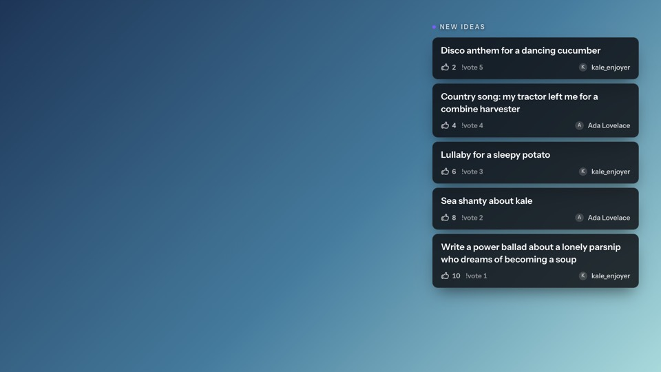
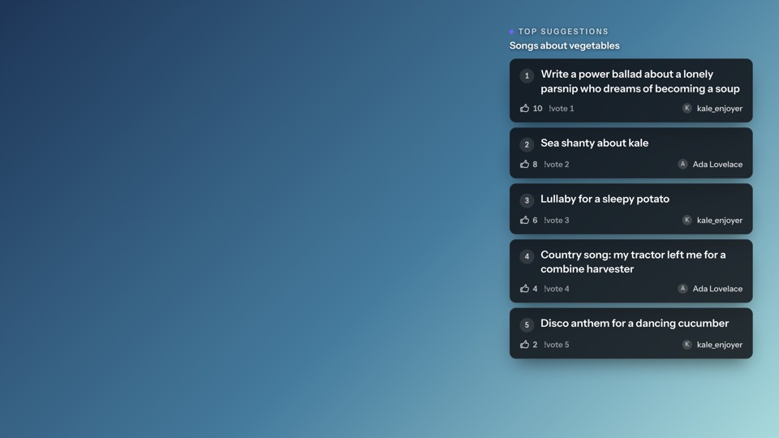
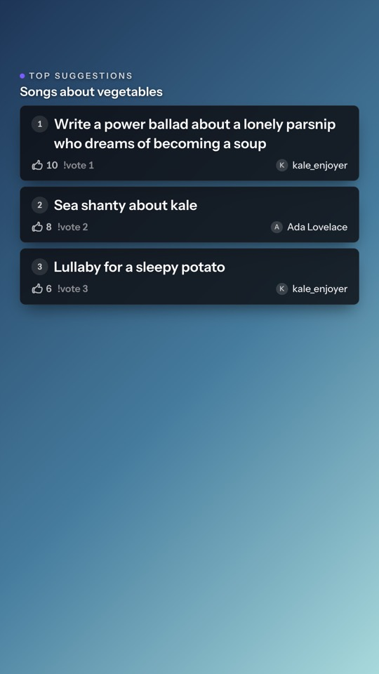
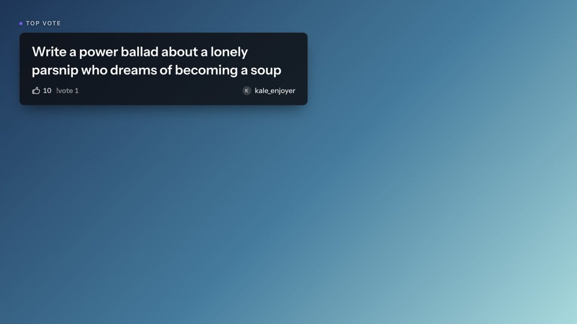
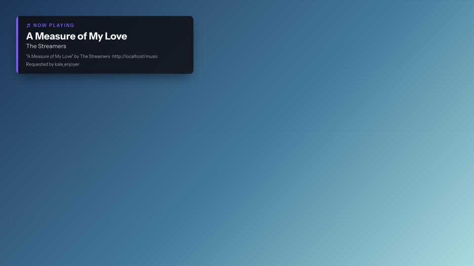
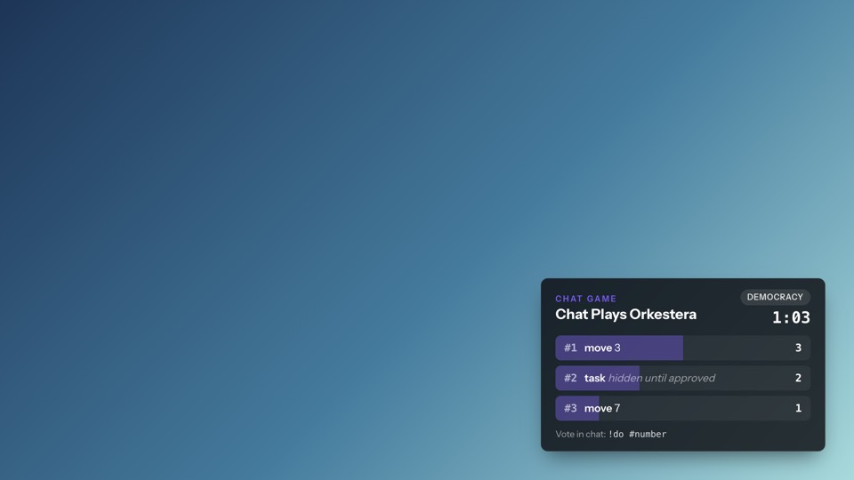
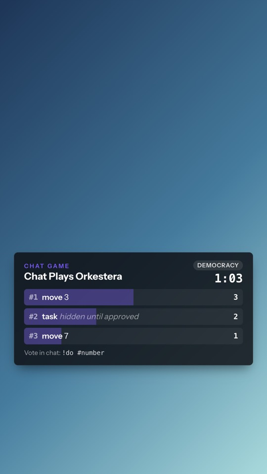
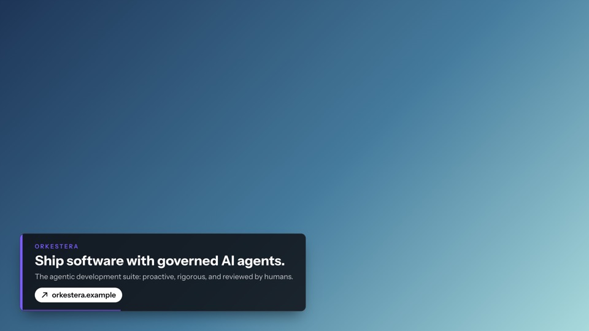
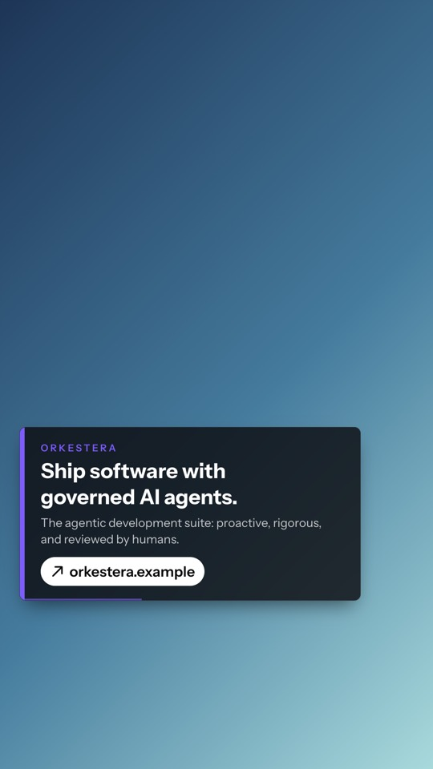
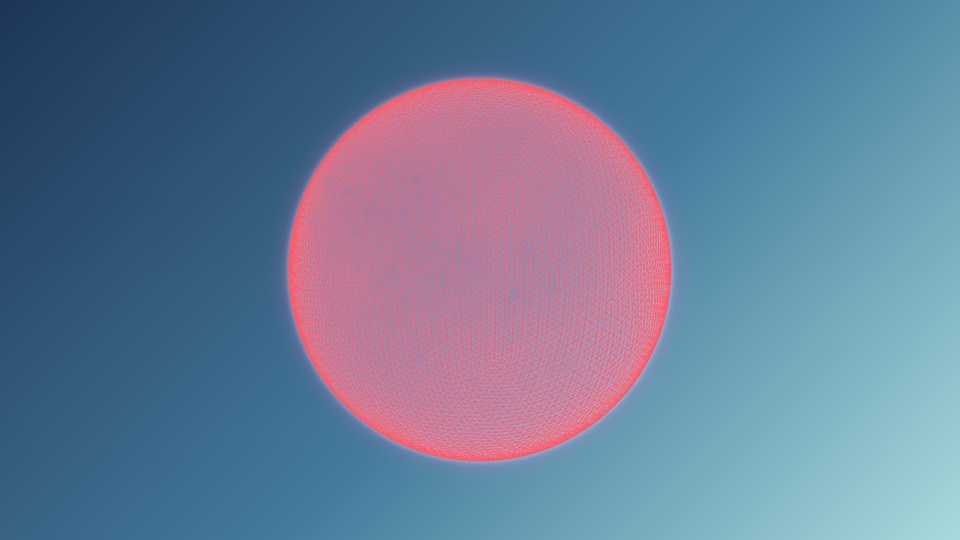

# OBS setup and verify guide

One page for adding ARE's overlays to OBS and checking them before a show. The show-day runbook (#156) links here. The why behind each setting is in the README's [OBS overlays](../README.md#obs-overlays) section.

Every overlay is a **Browser** source showing a transparent page. Set each one up once. After that it needs nothing, unless you rotate its token.

## 1. Get each overlay's URL

On the server, for each overlay you use:

```sh
php artisan overlay:token queue
```

It prints two URLs, one per layout, **once**. Only a hash is stored, so copy them straight into OBS. They look like this:

```
https://<your-domain>/overlay/queue?layout=horizontal#token=0a1b…
```

- **The token is after the `#`.** Browsers never send that part to the server, so it stays out of access logs (#58). Treat the URL like a password.
- **To add a query parameter** (the visualizer's `&audio=`), put it **before the `#`**. Anything after the `#` is ignored by the server.
- **To get a new URL** (a leak, or you lost it): `php artisan overlay:token queue --rotate`. The old URL stops working, and an open copy goes blank on its next refresh.
- **Old URLs with `?token=`** still work for one release but log a deprecation warning. Re-issue them with `--rotate`.

| Overlay | Name for `overlay:token` | Shows | Updates |
|---|---|---|---|
| Question queue | `queue` | The newest questions | Live; polls every 5–10 s without Reverb |
| Vote leaderboard | `vote` | Top questions by votes, and the topic | Live; polls every 5–10 s without Reverb |
| Top vote | `top-vote` | The single leading question | Live; polls every 5–10 s without Reverb |
| Now playing | `now-playing` | The song request on air | Polls every 5 s |
| Chat game | `bus` | The Chat Control Bus vote | Live; polls every 2–4 s without Reverb |
| Call to action | `cta` | Orkestera and EDOS lower-third, rotating | Static: a CSS animation, no server re-renders |
| Visualizer | `visualizer` | Audio-reactive sphere | Live audio (section 4), no server re-renders |
| Captions | `captions` | Nothing yet: no caption source | n/a |

## 2. Add a Browser source per overlay

**Sources → + → Browser**, then:

| Setting | Value | Why |
|---|---|---|
| URL | The URL from step 1, for the layout matching the canvas | |
| Width × Height | **1920 × 1080** for `layout=horizontal`, **1080 × 1920** for `layout=vertical` | The page draws on a fixed canvas of that size |
| Control audio via OBS | **Off** | No overlay plays sound. The visualizer only listens. |
| Use custom frame rate | Off | The canvas frame rate is fine |
| Custom CSS | **Leave the default** | OBS's default is a transparent body with no margin and no scrollbars, which is what the overlays expect. They set a transparent background themselves too, so no CSS is needed. |
| Shutdown source when not visible | **Off** (see below) | |
| Refresh browser when scene becomes active | **Off** (see below) | |
| Page permissions | **No access to OBS** | The overlays never call OBS |

Place each source at **0, 0** covering the whole canvas, and don't scale it. Each overlay positions its own panel: queue and vote top right, top-vote and now-playing top left, CTA bottom left, bus bottom right. In vertical, panels clear the Shorts/Reels caption block at the bottom and the action buttons on the right.

**Vertical (1080 × 1920)** needs a canvas of that size: for example, a separate OBS profile with a 1080 × 1920 base resolution, or a vertical-canvas plugin. Use the `layout=vertical` URLs there.

### Why "Shutdown" and "Refresh" stay off

- **The live overlays keep themselves current.** Queue, vote, top-vote and chat game update over Reverb when production has it, and poll when it doesn't (production today). While on the socket, they still re-render every 60–90 s. Now playing polls every 5 s. Every server render **re-checks the overlay's token**, so a rotated token blanks these overlays whether or not OBS reloads them.
- **The static overlays don't re-render.** A rotated token stops `cta`, `visualizer` and `captions` the next time they load (an OBS restart, or a manual Refresh), but an open copy keeps showing until then.
- **"Shutdown source when not visible" on** destroys the page whenever the source is hidden, and loads it fresh when shown. Each load goes through the token exchange (a blank second), and the visualizer re-opens its audio device. Off, a hidden page just stops drawing; Chromium may slow its timers, so it catches up within one poll of being shown. Turn it on only for the visualizer, and only if you want the microphone released while its scene is off air.
- **"Refresh browser when scene becomes active" on** reloads the page on every scene switch: the same blank second, for nothing. It also spends the token exchange's rate limit, 30 a minute per overlay.

## 3. What each overlay should look like

These are screenshots over a stand-in background, rendered from the app with sample data. On stream, everything outside the panels is transparent.

**Question queue** (`queue`, horizontal)



**Vote leaderboard** (`vote`, horizontal and vertical)





**Top vote** (`top-vote`)



**Now playing** (`now-playing`): blank when no song request is on air.



**Chat game** (`bus`): shows the open vote with a countdown. Free text such as `task` reads "hidden until approved" until a moderator approves it. Other states: *Awaiting moderator approval*, *Chat chose…*, PAUSED and KILLED. Blank with no game running.





**Call to action** (`cta`): rotates between the configured calls to action every 15 s (`ARE_CTA_ROTATE_SECONDS`). Blank until `ARE_CTA_ORKESTERA_URL` or `ARE_CTA_EDOS_URL` is set.





**Visualizer** (`visualizer`): a wireframe sphere that pulses with the audio. Without audio it only drifts and shifts colour.



**Captions** (`captions`): nothing yet. There's no caption source.

**Empty states are invisible.** An overlay with nothing to show (no questions, no song, no game) is a fully transparent page. That's correct, not broken: check it with step 5 instead.

## 4. The visualizer's audio (#72)

The visualizer listens to a **capture device**. OBS can't hand its mix to a browser source, so route the show audio to a virtual device:

1. **Install a virtual audio device.** On macOS, [BlackHole](https://github.com/ExistentialAudio/BlackHole). On Windows, [VB-CABLE](https://vb-audio.com/Cable/).
2. **Settings → Audio → Advanced → Monitoring Device:** choose that device. In **Edit → Advanced Audio Properties**, set the sources the visualizer should follow (music, mic) to **Monitor and Output**.
3. **Launch OBS with `--enable-media-stream`.** Without it, the visualizer can't open any audio device.
   - Windows: add it to the shortcut target, `"…\obs64.exe" --enable-media-stream`.
   - macOS: run `open -a OBS --args --enable-media-stream`. Also allow OBS under **System Settings → Privacy & Security → Microphone**.
   - **This flag lets every browser source use your microphone and camera.** Only add browser sources you trust.
4. **The URL:** insert `&audio=` **before the `#`**:

   ```
   https://<your-domain>/overlay/visualizer?layout=horizontal&audio=BlackHole#token=…
   ```

   - `audio=default` uses the default input device.
   - `audio=<label>` matches a device by name: an exact match first, then a substring, ignoring case.
   - `&gain=2` doubles its reaction (0.1 to 10).
   - Leave **Control audio via OBS** off.

## 5. Five-minute verify checklist

Do this after setting up, after rotating a token, and before a show.

1. **Readiness:** `/admin/readiness` is all green (#135).
2. **Each overlay loads:**
   - Right-click each source → **Interact**. A loaded overlay with data shows its panel.
   - An empty overlay is transparent. To tell "empty" from "broken", open **Help → Log Files → View Current Log** and search for `[ARE overlay]`. A line there means the token exchange failed, and it says why. For example, "Token refused (HTTP 403)" means the token was rotated: re-issue it with step 1.
3. **Queue, vote and top-vote follow chat:** submit a question on `/vote` and upvote it.
   - Within about 10 s (polling) or about 3 s (Reverb), it appears in `queue`.
   - Its count moves in `vote`, and it becomes `top-vote` if it leads.
4. **Now playing:** put a song request on air from `/music/requests`. It appears within 5 s.
5. **Chat game:**
   - Pick the game on `/bus` and type `!do` in chat. The vote and countdown appear, and counts follow within a few seconds.
   - Pause it on `/bus`: PAUSED appears.
   - Resume it.
6. **Call to action:** both items rotate within 30 s and show the right URLs.
7. **Visualizer:**
   - Play music through a source set to *Monitor and Output*. The sphere pulses.
   - In the OBS log, `[ARE visualizer] audio live: Listening to "…"` names your device.
   - If you see `denied`: the `--enable-media-stream` flag is missing.
   - If you see `no-device`: the label is wrong. The line lists the devices it can see.
   - If you see `unsupported`: the page isn't on HTTPS.
8. **Token rotation works** (optional, takes a minute and a half):
   - Run `php artisan overlay:token queue --rotate`. Within about 10 s while polling, or 90 s on Reverb, the open `queue` source goes blank.
   - Paste the new URL into the source.
   - Only the live overlays blank themselves (section 2).
9. **Vertical:** repeat step 2 on the 1080 × 1920 canvas, and check that no panel sits under the platform UI.

If an overlay shows OBS's own error page ("Couldn't load that page!"), the server isn't reachable from the streaming machine. That's not a token problem.
